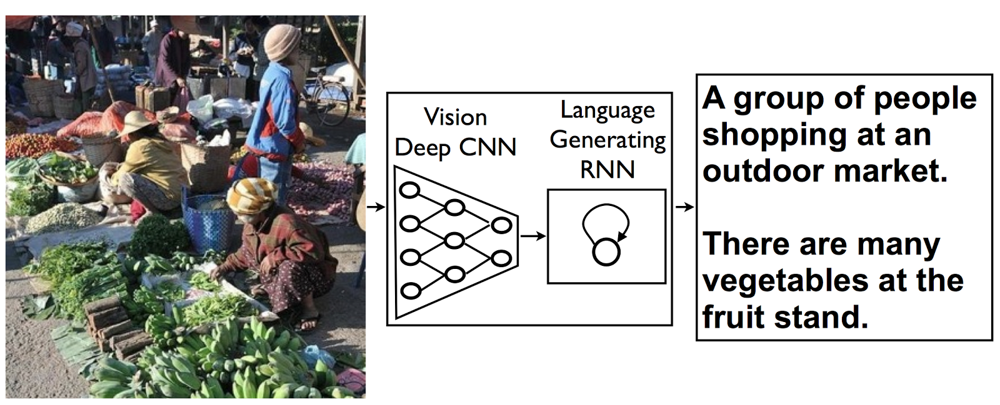

# IMAGE CAPTIONING PROJECT
In this project we will define and train an image-to-caption model, that can produce descriptions for real world images!

[Model architecture: CNN encoder and RNN decoder](https://research.googleblog.com/2014/11/a-picture-is-worth-thousand-coherent.html)

## Welcome!
**Image Captioning** is the process of generating textual description of an image. It uses both **Natural Language Processing** and **Computer Vision** to generate the captions. The dataset will be in the form **[image → captions]**. The dataset consists of input images and their corresponding output captions.

## project Structure
The hands on project on Image Captioning divided into following tasks:

### Task 1: Import stuff

### Task 2: Download data

### Task 3: Extract image features

### Task 4: Extract captions for images

### Task 5: Prepare captions for training

### Task 6: Training - Define architecture

### Task 7: Training loop

### Task 8: Applying model
